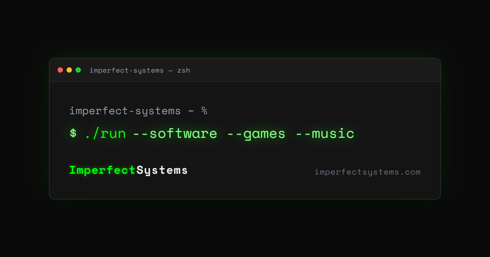

# @vdaluz/astro-og-cards

[](https://www.npmjs.com/package/@vdaluz/astro-og-cards)
[](https://github.com/vdaluz/astro-og-cards/actions/workflows/ci.yml)
[](LICENSE)

Social shares need an OG image, and generating one at build time from real post data (not a hand-designed static fallback) usually means wiring up a headless browser or a from-scratch Satori setup yourself. `@vdaluz/astro-og-cards` packages both halves: a meta-tag emission component for the `og:*`/`twitter:*` tags, and a build-time card generation harness (satori + sharp) that renders styled HTML to a real PNG. Ships raw `.astro`/`.ts` - the consuming app's Astro/Vite compiles them (no prebuild step), same as `@vdaluz/astro-blog`. Proven in production on [vdaluz.com](https://vdaluz.com) and [imperfectsystems.com](https://imperfectsystems.com).

## Install

```
npm install @vdaluz/astro-og-cards
```

Peer dependency: `astro` >= 6.

> **Installing this pulls in native `sharp`.** `satori`, `satori-html`, and `sharp` are regular
> `dependencies`, not optional ones, so every consumer installs all three even if it only uses
> `OgMeta` (pure meta tags, no image generation). That's an intentional tradeoff, not an
> oversight: card generation is this package's actual point, and splitting `OgMeta` into its own
> zero-dependency package for the rare meta-tags-only consumer isn't worth the maintenance
> overhead of a second package for one component. If that changes, revisit an optional
> peerDependency split.

## Meta tags

```astro
---
import OgMeta from '@vdaluz/astro-og-cards/OgMeta.astro';
---

<OgMeta
  title="Page title"
  description="Page description"
  image="https://example.com/og/page.png"
  url="https://example.com/page"
  siteName="Example Site"
/>
```

Emits the full `og:*`/`twitter:*` tag set (title, description, image, url, type, site name, twitter card, including `twitter:image:alt`). `imageWidth`/`imageHeight` default to 1200/630 (matching `generateCard`'s defaults) but are optional props if your image is a different size.

For a blog post, pass `type="article"` plus `publishedTime`/`modifiedTime` (ISO 8601) to emit `article:published_time`/`article:modified_time`:

```astro
<OgMeta
  title={post.title}
  description={post.description}
  image={ogImageUrl}
  url={postUrl}
  siteName="Example Site"
  type="article"
  publishedTime={post.pubDate.toISOString()}
  modifiedTime={post.updatedDate?.toISOString()}
/>
```

## Card generation

```ts
import { generateCard } from '@vdaluz/astro-og-cards';

const png = await generateCard(inlineStyledHtml); // Buffer, 1200x630 PNG
```

`markup` must use **inline styles, not `<style>` blocks or CSS classes** - `satori-html` (the HTML-to-Satori adapter) only reads inline styles. A hand-designed card with `<style>` + classes needs manual translation to inline styles first; see `src/assets/fixtures/imperfectSystemsCard.ts` for a worked example (imperfectsystems.com's real default card, translated).

### Example

Real output from `generateCard(imperfectSystemsCard)`, the fixture above, unmodified:



Bundles a default static (non-variable) font, [Space Mono](https://github.com/googlefonts/spacemono) (OFL-licensed). Pass `fonts` in the options to override.

### Known gotchas

- **Use `sharp` for SVG->PNG, not `@resvg/resvg-js`.** resvg-js 2.6.2 (latest stable as of writing) native-panics (uncatchable Rust abort, not a JS exception) on Satori's `feDropShadow`/`feGaussianBlur` filter output - i.e. any `box-shadow` or `text-shadow` in the source markup. Confirmed via binary search against a real shadow-bearing design; independent of shadow color format (hex vs `rgba()`).
- **Variable fonts fail to parse.** Satori's bundled font parser (`@shuding/opentype.js`) can't read variable-font files (e.g. macOS's system SF Mono, which has an `fvar` table). Always pass a static font weight, never a system font reference.
- **The bundled default font is embedded as base64 in `src/lib/spaceMonoData.ts`, not read from a sibling `.ttf` file at runtime.** Confirmed via a real `astro build`: Vite/Rollup bundles this package's source into a new chunk file at a different physical location in the consumer's build output, so any `import.meta.url`-relative disk read breaks there (regardless of whether it's written as `new URL(...)` or a plain `path.join` - both are equally broken, since the problem is the module's *code* being relocated, not a specific path-construction pattern Vite's static analyzer happens to intercept). The raw `.ttf` files live in the repo's root-level `assets/fonts/` (kept for provenance/license visibility and to regenerate the base64 if the font is ever updated, but outside `src/` so the npm package doesn't publish them - they aren't imported by any code path). The OFL license text ships alongside the base64 module itself at `src/lib/OFL.txt`, since that module is the actual redistribution of the font data.
- `satori-html` is stale (last published Dec 2022) but works correctly against the current Satori API as of this writing - the smoke test (`npm test`) is the tripwire for a future break.
- **`satori-html` unconditionally trims every text node's value**, so a literal space in a text node right before an inline-styled `<span>` is silently dropped (and a non-breaking space doesn't survive either - JS `trim()` treats it as whitespace too). Give the following span an explicit `margin-left` (or the preceding element a `margin-right`) instead of relying on a whitespace character between elements.

## Contributing

Issues welcome. PRs by discussion - open an issue first for anything beyond a typo or docs fix.

### Releasing

Maintainer-only. Releases are tag-triggered and published to npm via GitHub Actions (Trusted
Publishing / OIDC, no token secret):

1. Test before tagging: `npm pack`, install the tarball into a scratch Astro app (or a consumer
   locally), `astro check && astro build`.
2. Bump `version` in `package.json`, commit.
3. Tag `vX.Y.Z` and push the tag. Pushing the tag runs `.github/workflows/publish.yml`, which
   type-checks, tests, verifies the tag matches `package.json`'s version, and only then runs
   `npm publish`.
4. Confirm the version is live: `npm view @vdaluz/astro-og-cards version`. Consumers bump their
   own semver pin once it's confirmed live - see this package's CHANGELOG.md for what changed.

## Consumers

- [vdaluz.com](https://vdaluz.com)
- [imperfectsystems.com](https://imperfectsystems.com)
- [freetoolbox.net](https://freetoolbox.net)
- [wq1k.com](https://wq1k.com)
- [vicstradamus.com](https://vicstradamus.com) (devDependency, build-time card generation only)

## License

MIT
